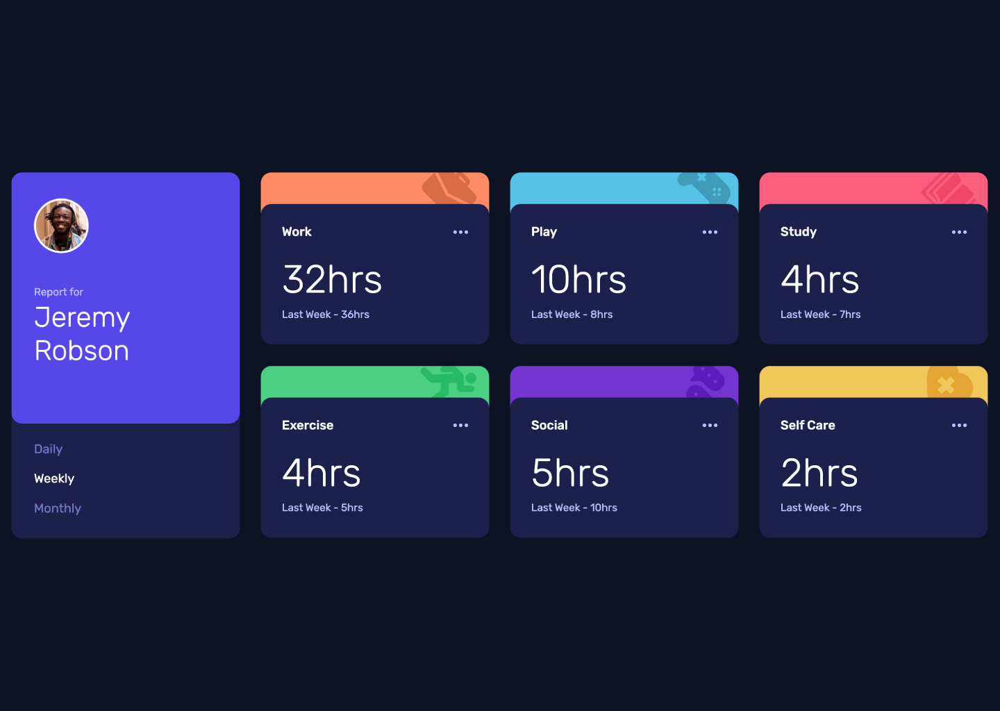

# Frontend Mentor - Time tracking dashboard solution

This is a solution to the [Time tracking dashboard challenge on Frontend Mentor](https://www.frontendmentor.io/challenges/time-tracking-dashboard-UIQ7167Jw)

## Table of contents

- [The challenge](#the-challenge)
- [Screenshot](#screenshot)
- [Links](#links)
- [Built with](#built-with)
- [Author](#author)

## The challenge

Users should be able to:

- View the optimal layout for the site depending on their device's screen size
- See hover states for all interactive elements on the page
- Switch between viewing Daily, Weekly, and Monthly stats

## Screenshot

## Links

- Solution URL: [https://github.com/iflucian/time-tracking-dashboard](https://github.com/iflucian/time-tracking-dashboard)
- Live Site URL: [https://iflucian.dev/practice/time-tracking-dashboard/](https://iflucian.dev/practice/time-tracking-dashboard/)

## Built with

- Semantic HTML5 markup
- CSS custom properties
- Flexbox
- CSS Grid
- Vanilla JavaScript

## Author

- Website - [Lucian](https://www.iflucian.dev)
- Frontend Mentor - [@iflucian](https://www.frontendmentor.io/profile/iflucian)
